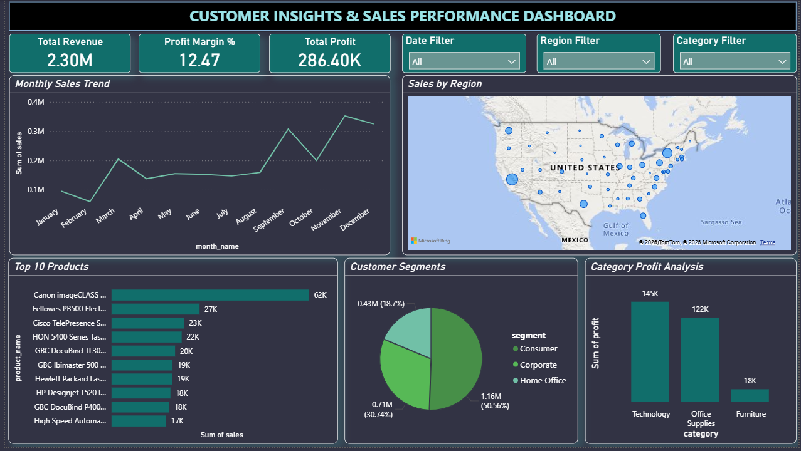

# 📊 Retail Sales Analytics Dashboard

An end-to-end Data Analytics project developed to analyze retail sales data and provide actionable business insights through an interactive Power BI dashboard.

---

## 📷 Dashboard Preview



---

## 📌 Project Overview

This project was developed as part of an **End-to-End Data Analytics Capstone Project**. It focuses on analyzing retail sales data to uncover trends in sales, profit, customer segments, and regional performance. The data was cleaned and analyzed using Python, and the findings were visualized through an interactive Power BI dashboard to support data-driven business decision-making.

---

## 🎯 Objectives

- Analyze overall sales and profit performance
- Identify top-performing products and categories
- Compare sales across different regions
- Understand customer segmentation
- Build an interactive dashboard for business insights

---

## 🛠️ Technologies Used

- Python
- Pandas
- NumPy
- Matplotlib
- Seaborn
- Power BI
- Microsoft Excel

---

## 📂 Dataset

**Dataset:** Sample Superstore Dataset

The dataset contains information about:

- Orders
- Customers
- Products
- Categories & Sub-categories
- Regions
- Sales
- Profit
- Quantity
- Discount

---

## 🔍 Data Analysis

The following steps were performed before creating the dashboard:

- Data Cleaning
- Handling Missing Values
- Removing Duplicates
- Feature Engineering
- Exploratory Data Analysis (EDA)
- Business Insight Generation

---

## 📊 Dashboard Features

The interactive dashboard includes:

### KPI Cards
- Total Sales
- Total Revenue
- Total Profit
- Profit Margin

### Visualizations
- Monthly Sales Trend
- Sales by Region
- Sales by Category
- Top 10 Products
- Customer Segment Distribution

### Interactive Filters
- Region
- Category
- Date

---

## 📈 Key Business Insights

- Identified top-performing product categories based on sales and profit.
- Compared sales performance across different regions.
- Analyzed monthly sales trends to identify business patterns.
- Evaluated customer segment contribution to overall sales.
- Provided business recommendations using data-driven insights.

---

## 📁 Repository Structure

```text
Retail-Sales-Analytics-Dashboard/
│
├── Dashboard/
│   └── Customer_Insights_Dashboard.pbix
│
├── Data/
│   ├── SampleSuperstore.csv
│   └── Cleaned_superstore_data.csv
│
├── Python/
│   ├── Capstone_Project.ipynb
│   └── capstone_project.py
│
├── Presentation/
│   ├── Customer Insights & Sales Performance Dashboard.pdf
│   └── Customer Insights & Sales Performance Dashboard.pptx
│
├── dashboard_image.png
│
├── requirements.txt
├── README.md
└── LICENSE
```

---

## 🚀 How to Run

### 1. Clone the Repository

```bash
git clone https://github.com/your-username/Retail-Sales-Analytics-Dashboard.git
```

### 2. Install Required Libraries

```bash
pip install -r requirements.txt
```

### 3. Run the Analysis

- Open `Capstone_Project.ipynb` using Jupyter Notebook.
- Execute the notebook to perform data cleaning and analysis.

### 4. Open the Dashboard

Open `Customer_Insights_Dashboard.pbix` using **Microsoft Power BI Desktop**.

---

## 📌 Future Improvements

- Implement Machine Learning for sales forecasting.
- Add customer churn prediction.
- Connect the dashboard to a live SQL database.
- Enable automatic data refresh.
- Build an AI-powered chatbot for dashboard insights.

---

## 💡 Skills Demonstrated

- Data Cleaning
- Exploratory Data Analysis (EDA)
- Data Visualization
- Dashboard Development
- Business Analytics
- Business Storytelling
- Python Programming
- Power BI
- Data-Driven Decision Making

---

## 👩‍💻 Author

**Gudiya Kumari Sharma**

---

## ⭐ If you found this project helpful, consider giving it a star!
